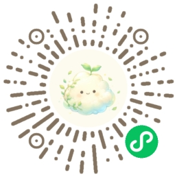
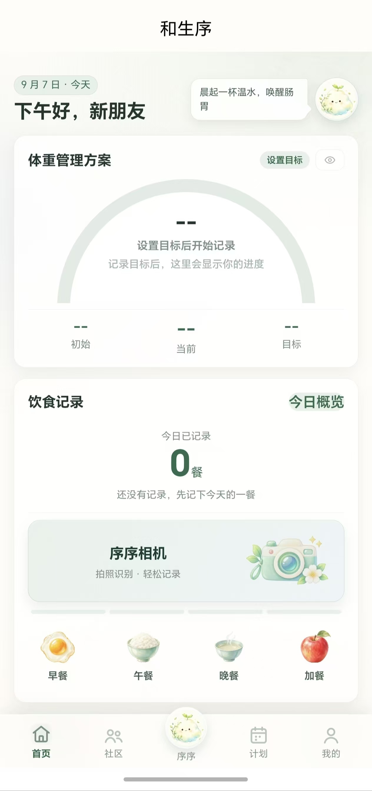
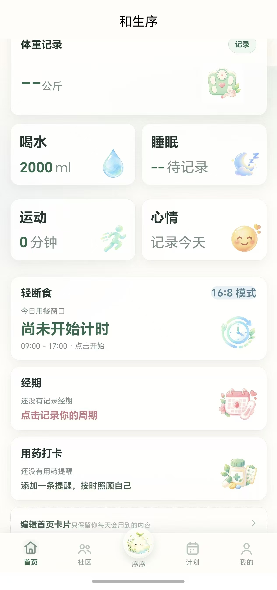
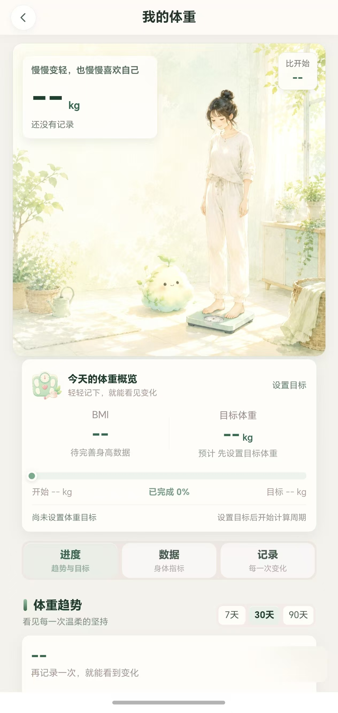
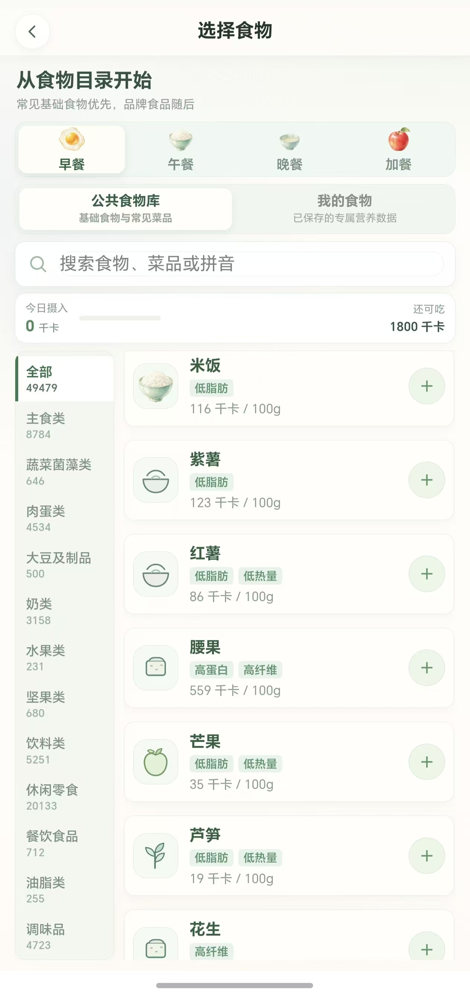
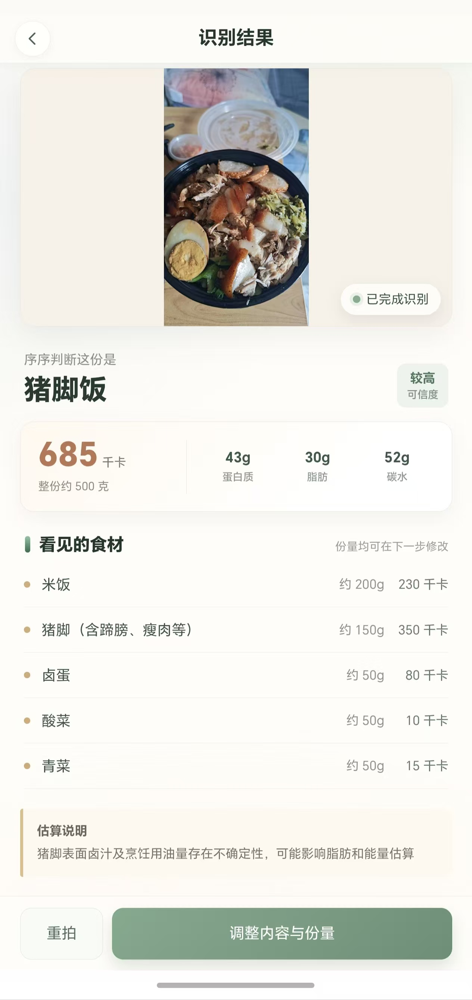
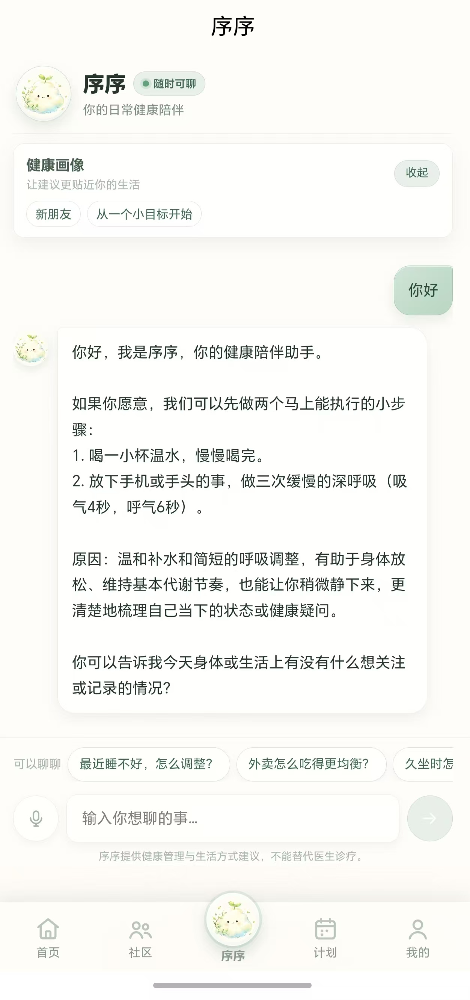
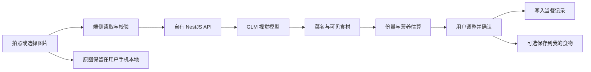
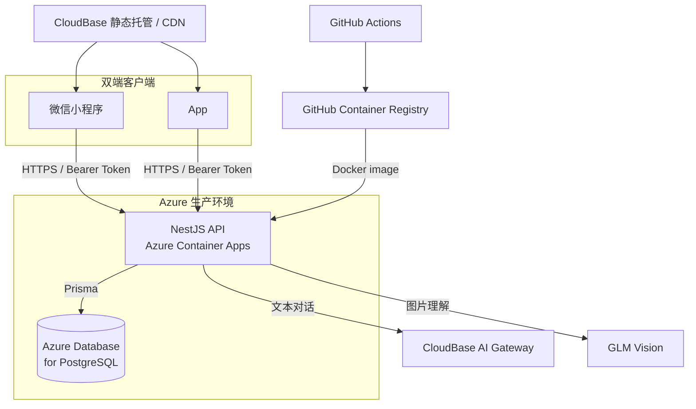

# 和生序

> 让健康，回到自己的节律。

和生序是一套由个人独立完成的 AI 健康管理产品，覆盖**微信小程序与 App**。项目从产品定义、交互与视觉设计出发，完成了 uni-app 双端客户端、NestJS API、PostgreSQL 数据模型、AI 健康对话、食物拍照识别、Docker 容器化以及 Azure / CloudBase 生产部署。

[在线项目展示](https://tl66666.github.io/heshengxu-health/) · [部署说明](docs/DEPLOYMENT.md) · [发布检查清单](docs/RELEASE-CHECKLIST.md) · [安全说明](SECURITY.md)

## 微信小程序体验

扫描下方小程序码即可打开“和生序”微信小程序。小程序使用微信授权登录，与 App 共用真实生产 API、食物库、序序聊天和拍照识别能力。




## 项目亮点

| 能力       | 已实现内容                                                                     |
| ---------- | ------------------------------------------------------------------------------ |
| 双端产品   | 一套 Vue 3 + uni-app + TypeScript 客户端，同时构建微信小程序与 App             |
| 健康记录   | 体重、饮食、饮水、运动、睡眠、心情、生理期、用药、轻断食与计划                 |
| 食物数据   | **49,479 条**公共食物目录，基础食材优先、分类浏览、名称/菜品/拼音搜索          |
| 序序相机   | 识别组合菜品、拆分可见食材、估算份量/热量/三大营养素，支持用户修改与确认       |
| 个人食物库 | AI 识别结果可保存到当前用户的“我的食物”，原始照片保留在用户手机本地            |
| 序序聊天   | 真实大模型回复、对话自动滚动、健康安全边界与明确的失败状态                     |
| 工程交付   | NestJS、Prisma、PostgreSQL、Docker、GHCR、Azure Container Apps、GitHub Actions |
| 视觉系统   | 高明度日系治愈奶油水彩风格，品牌角色序序贯穿引导、首页、记录和 AI 场景         |

## 真实产品

下列图片均为 2026 年 9 月实际运行截图，不是设计稿或静态原型。

<table>
  <tr>
    <td width="33%"><br/><b>每日健康首页</b><br/>目标、饮食与序序相机集中在同一入口</td>
    <td width="33%"><br/><b>健康记录矩阵</b><br/>体重、饮水、睡眠、运动、心情与照顾提醒</td>
    <td width="33%"><br/><b>体重管理</b><br/>BMI、目标差距、趋势与历史记录</td>
  </tr>
  <tr>
    <td><br/><b>49,479 条食物目录</b><br/>公共数据与个人食物库分层</td>
    <td><br/><b>真实菜品识别</b><br/>猪脚饭、可见食材和营养估算</td>
    <td><br/><b>序序 AI 陪伴</b><br/>基于真实服务响应的生活方式建议</td>
  </tr>
</table>

## 序序相机如何工作

识别流程不是“在食物库里按图片找一个相似名称”。它允许模型理解数据库中没有预置的组合菜品，并把结果转换为用户能够检查和修改的结构化数据。



1. **端侧图片读取**：微信小程序使用小程序文件系统；App 使用原生文件读取能力，分别处理平台临时路径并转换为受控输入。
2. **服务端代理**：图片发送给项目自己的 NestJS API。视觉模型密钥只存在 Azure 服务端 Secret / 环境变量中，不进入客户端安装包或仓库。
3. **视觉理解**：GLM 视觉模型判断整道菜并拆分可见组成。例如猪脚饭可以拆成米饭、猪脚、卤蛋、酸菜和青菜，而不要求“猪脚饭”已存在于公共目录。
4. **结构化营养结果**：服务端约束模型返回菜名、置信度、估算总重量、能量、蛋白质、脂肪、碳水、食材组成和估算说明。
5. **人工确认**：AI 结果不会直接写入记录。用户可以调整名称、食材和份量，再明确确认。
6. **双向落库**：确认后生成带营养快照的餐次记录；用户可以同时保存为个人食物，便于以后直接搜索和复用。个人食物按用户隔离，不污染 49,479 条公共目录。

拍照识别属于营养估算，图片角度、遮挡、烹饪用油和调味料会带来误差，因此产品同时展示置信度与估算说明，并始终保留用户修改权。

## 49,479 条食物数据

食物库承担的是可搜索、可计算的产品基础设施，而不是首页上的几条演示数据。

- 公共目录包含主食、蔬菜菌藻、肉蛋、大豆及制品、奶类、水果、坚果、饮料、休闲零食、餐饮食品、油脂和调味品等分类。
- 米饭、鸡蛋等常见无品牌基础食物通过 `catalogRank` 优先展示，品牌食品随后，避免大量商品名淹没日常选择。
- 支持名称、菜品和拼音搜索，并保留分类数量与分页查询。
- 营养数据按每 100 克保存；用户选择或编辑份量时生成该餐次的营养快照，历史记录不会因为公共数据后续调整而被悄悄改写。
- “公共食物库”与“我的食物”是两个清晰的数据层级。AI 识别和自定义内容只归属于创建它的用户。


## 健康管理闭环

### 建档、体重与目标

- 建档时记录身高、体重并即时计算 BMI。
- 设置目标体重后，以半圆进度和目标差距呈现当前阶段。
- 每次体重记录使用真实时间，支持新增、编辑、删除、7/30/90 天趋势回顾与隐私隐藏。

### 饮食、饮水与运动

- 早餐、午餐、晚餐与加餐共享真实食物目录、个人食物和拍照识别流程。
- 饮水目标可编辑，水、茶、牛奶等饮品分别记录并汇总当天实际摄入。
- 运动记录包含活动类型、时长、强度、感受与历史回看。

### 睡眠、心情与日常照顾

- 睡眠使用入睡和醒来时间自动计算时长，并可补充质量、梦境与备注。
- 心情支持情绪、能量感受和文字记录，让周报不只看到生理指标。
- 生理期支持周期参数与预测窗口；用药支持药品、剂量、频次、时段和服用状态。
- 轻断食包含方案选择、进食窗口、实时计时、结束记录与首页状态同步。

### 计划与序序陪伴

- 用户可以把目标拆成每天可完成的小行动，连续天数和周节律来自真实完成记录。
- 序序聊天通过 CloudBase AI Gateway 连接文本模型，由服务端统一处理鉴权、上下文、超时和安全边界。
- 序序提供健康管理与生活方式参考，不进行疾病诊断、处方判断或药物剂量决策。

## 双端设计

同一套业务代码通过条件编译处理平台差异，而不是维护两个互相漂移的客户端。

| 关注点    | 微信小程序                                               | App                                                   |
| --------- | -------------------------------------------------------- | ----------------------------------------------------- |
| 身份入口  | `wx.login` 获取临时 code，服务端换取并绑定微信身份       | 邮箱/账号与密码注册登录                               |
| 图片读取  | 微信文件系统读取临时图片                                 | App 原生文件 API 读取相册/相机文件                    |
| UI 与业务 | 复用 Vue 3 页面、Pinia 状态、领域规则和 API client       | 复用 Vue 3 页面、Pinia 状态、领域规则和 API client    |
| 构建发布  | uni-app 编译到 `mp-weixin`，微信开发者工具上传           | HBuilderX 原生 App 云打包，Android 使用固定包名和签名 |
| 数据隔离  | 服务端数据按认证用户隔离；本地数据按微信身份命名空间隔离 | 服务端数据按认证用户隔离；本地数据按账号命名空间隔离  |

当前仓库能够构建微信小程序与 App；Android 安装包已完成云端打包验证。iOS 商店发布仍需要 Apple Developer 账号、证书、Bundle ID 与平台审核，不在仓库中伪装为已经上架。

## 技术架构



| 层级     | 技术与职责                                                  |
| -------- | ----------------------------------------------------------- |
| 客户端   | Vue 3、uni-app、TypeScript、Pinia、平台条件编译             |
| API      | NestJS、DTO 校验、用户鉴权、OpenAPI、AI 代理与错误边界      |
| 数据层   | Prisma、PostgreSQL、迁移、关系约束与用户级查询              |
| AI       | CloudBase AI Gateway 文本能力、GLM 视觉理解、结构化结果解析 |
| 交付     | Docker、GitHub Container Registry、Azure Container Apps     |
| 静态资源 | CloudBase 静态托管 / CDN，客户端使用合法下载域名            |
| 质量     | TypeScript、ESLint、Prettier、Vitest、GitHub Actions        |

## 数据、安全与可靠性

- 客户端只调用自有 API，不内置数据库密码、微信 AppSecret 或 AI API Key。
- 密钥通过 Azure Container Apps Secret / 环境变量注入，不提交到 Git 或写入 README。
- API 从认证上下文获取 `userId`，记录查询、个人食物、AI 任务和写入操作都带用户所有权约束。
- 小程序微信身份与 App 账号使用各自认证入口，但最终都转换为服务端会话与访问令牌。
- 拍照识别要求用户明确授权；模型失败、超时或返回非法结构时显示真实错误，不伪造成功结果。
- 营养估算、AI 建议与医疗诊断严格分界，界面提供相应风险说明。

## 工程质量

最近一次完整验证记录包含：

- 客户端：73 个测试文件，**198 个测试通过，1 个跳过**。
- API：31 个测试文件，**64 个测试通过**（包含临时 PostgreSQL 上的迁移与集成测试）。
- 生产链路：API 构建、微信小程序生产构建、App 构建、展示站构建。
- 发布检查：数据库迁移、健康检查、合法域名、客户端密钥扫描、包体与资源路径检查。

GitHub Actions 在推送和 Pull Request 时执行数据库迁移演练、类型检查、测试与生产构建。API 镜像由 Docker 构建并推送到 GHCR，再由 Azure Container Apps 拉取运行。

## 本地开发

环境要求：Node.js 24.x、npm；联调本地 API 时需要 Docker Desktop。

```powershell
git clone https://github.com/tl66666/heshengxu-health.git
cd heshengxu-health
npm install
```

启动小程序开发构建：

```powershell
cd apps/mini
npm run dev:mp-weixin
```

启动 API：

```powershell
cd apps/api
npm run start:dev
```

本地环境变量以 [`.env.example`](.env.example) 和 [`apps/api/.env.example`](apps/api/.env.example) 为模板。真实值只保存在未跟踪的 `.env` 文件或云端 Secret 中。

## 构建与发布

### 微信小程序

```powershell
$env:VITE_MINI_API_BASE_URL='https://api-heshengxu-prod.yellowsky-5fa044e1.eastasia.azurecontainerapps.io/api/v1'
$env:VITE_MINI_ASSET_BASE_URL='https://tl-d2ghzbl1p09ccaae3-1474520495.tcloudbaseapp.com/heban'
./scripts/build-mini.ps1
```

构建产物位于 `apps/mini/dist/build/mp-weixin`，使用微信开发者工具导入并上传。

### App

HBuilderX 应打开完整 uni-app 项目，而不是 `dist` 构建目录：

```text
D:\禾伴\heban-ai-health-demo\apps\mini
```

若 HBuilderX 在中文路径下出现打包异常，可打开指向同一份源码的英文目录联接：

```text
D:\heshengxu-mini\apps\mini
```

Android 安装包下载：[`assets/showcase/heshengxu-android.apk`](assets/showcase/heshengxu-android.apk)。这是当前 HBuilderX 云打包测试包，正式商店发布仍需完成签名、隐私协议和审核。

先运行 `npm --prefix apps/mini run build:app`，再在 HBuilderX 中选择“发行 → 原生 App-云打包”。详细步骤见 [`docs/APP-RELEASE-HBUILDERX.md`](docs/APP-RELEASE-HBUILDERX.md)。

### API 容器

```powershell
docker build -f Dockerfile.api -t heshengxu-api:local .
docker run --rm -p 3000:3000 --env-file apps/api/.env heshengxu-api:local
```

生产 API 运行在 Azure Container Apps，业务数据由 Azure Database for PostgreSQL 保存；静态水彩插画通过 CloudBase CDN 分发。

## 仓库结构

```text
apps/mini/              微信小程序与 App 共用客户端
apps/api/               NestJS API、Prisma schema 与迁移
packages/contracts/     跨端请求与响应契约
packages/domain/        可测试的领域规则
assets/illustrations/   品牌水彩插画原始资源
assets/showcase/        项目展示所用真实运行截图
showcase/               GitHub Pages 项目展示站
scripts/                构建、资源处理与仓库检查脚本
infra/                  Docker 与部署辅助配置
docs/                   产品、工程、部署与发布文档
```

## 文档

- [文档中心](docs/README.md)
- [生产部署](docs/DEPLOYMENT.md)
- [发布检查清单](docs/RELEASE-CHECKLIST.md)
- [HBuilderX App 发布](docs/APP-RELEASE-HBUILDERX.md)
- [工程交接说明](docs/engineering/handoff.md)
- [安全与公开仓库规则](SECURITY.md)
- [展示站维护说明](showcase/README.md)

## 当前边界

当前版本的 API、PostgreSQL、AI 代理、食物目录、静态资源 CDN、小程序与 App 构建链路均已实现。部分以本地优先保存的健康记录尚未提供跨设备同步；App 应用商店与 iOS 发布资料仍需在对应平台完成。仓库明确记录这些边界，不使用假数据或未交付状态冒充已上线能力。

健康建议仅用于健康管理和生活方式参考，不替代医生诊疗。

## 微信小程序上传前速查

正式上传前必须在仓库根目录执行 `scripts/build-mini.ps1`。该脚本会把位图引用切换到 CloudBase HTTPS CDN、删除构建目录中的本地位图，并校验产物体积。最近一次实际构建结果约为 **0.88 MB**。

微信开发者工具只导入并上传：

```text
D:\禾伴\heban-ai-health-demo\apps\mini\dist\build\mp-weixin
```

不要上传 `apps/mini/dist/dev/mp-weixin`（开发预览目录），也不要上传未执行正式脚本的 `dist/build/mp-weixin`，后者会把约 60 MB 原图打进包并触发微信 `80051 source size exceed`。原始图片仍完整保存在 `assets/`，由 CloudBase CDN 提供运行时资源。

## HBuilderX App 源码路径

HBuilderX 应打开源码，不是 `dist` 目录。当前推荐使用英文路径联接：

```text
D:\heshengxu-mini\apps\mini
```

它与仓库源码 `D:\禾伴\heban-ai-health-demo\apps\mini` 指向同一份文件，修改会同步；App 云打包包含这份源码中的最新代码。
